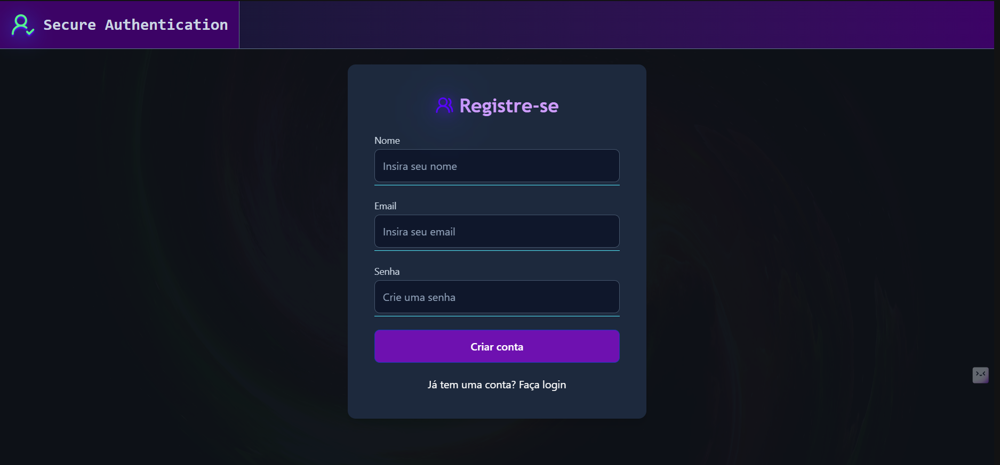
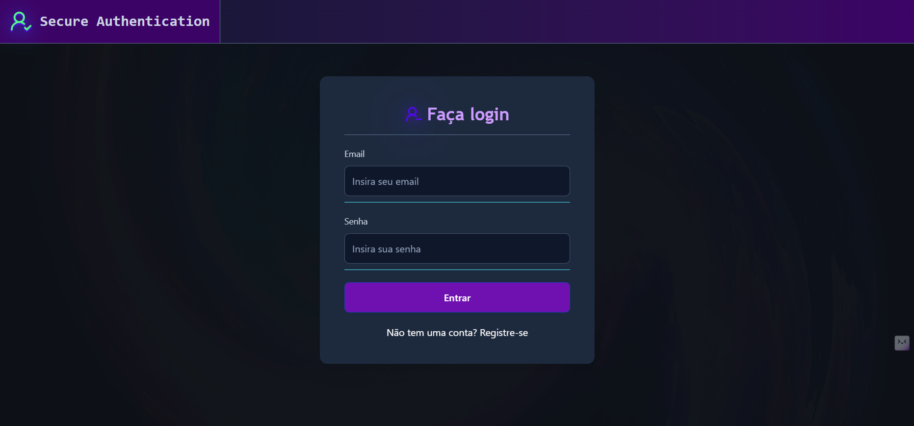
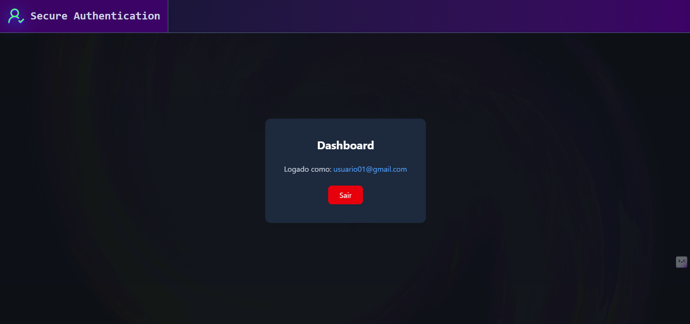

# 🔐 JWT Auth — Fullstack Authentication System

<p align="center">
  
  
  
  
  
  
</p>

<p align="center">
  
  
  
  
  
</p>

<p align="center">
  
</p>

---

## 📝 Sobre o Projeto

O **JWT Auth** é um sistema de autenticação **stateless** completo, do backend ao frontend, implementando o fluxo moderno de segurança com **JSON Web Tokens**. O projeto cobre desde o cadastro com hash de senha via **BCrypt**, geração e validação de tokens JWT com **HMAC-SHA256**, até o consumo autenticado de rotas protegidas no frontend React.

O foco principal deste desenvolvimento foi a aplicação prática de **Spring Security**, compreendendo a fundo o funcionamento da `SecurityFilterChain`, filtros customizados com `OncePerRequestFilter`, e o gerenciamento de contexto de autenticação via `SecurityContextHolder`.

---

## 📸 Galeria de Telas

<p align="center">
  
  
</p>
<p align="center">
  
</p>

---

## ✨ Funcionalidades Principais

- **🔑 Cadastro Seguro:** Registro de usuários com validação de campos e hash de senha via `BCryptPasswordEncoder`, garantindo que senhas nunca sejam armazenadas em texto puro.
- **🎫 Autenticação JWT:** Login com geração de token **HS256** contendo claims de identificação (`subject`), emissão (`iat`) e expiração (`exp`), utilizando a biblioteca **jjwt**.
- **🛡️ Filtro de Segurança:** Interceptação de todas as requisições via `JwtAuthFilter` (`OncePerRequestFilter`), validando tokens e populando o `SecurityContextHolder` por thread.
- **🚪 Rotas Protegidas:** Configuração de `SecurityFilterChain` com rotas públicas (`/api/auth/**`) e protegidas (`anyRequest().authenticated()`), política **STATELESS** sem sessão no servidor.
- **📡 API REST Consumida:** Frontend React consome a API com envio automático do token JWT no header `Authorization: Bearer <token>` em toda requisição autenticada.
- **🚀 Dashboard Autenticado:** Decodificação do payload JWT no cliente para exibir dados do usuário logado, com logout via remoção do token do `localStorage`.

---

## ⚙️ Arquitetura do Sistema

```text
┌─────────────────────────────────────────────────────────────┐
│                    FRONTEND (React + TypeScript)              │
│                                                              │
│  Register ──→ Login ──→ [JWT Token] ──→ Dashboard            │
│                              │                               │
│              localStorage.setItem("token", jwt)              │
└──────────────────────────────┬───────────────────────────────┘
                               │ HTTP + Authorization: Bearer
                               ▼
┌─────────────────────────────────────────────────────────────┐
│                   BACKEND (Spring Boot)                      │
│                                                              │
│  ┌─────────────┐    ┌────────────┐    ┌──────────────────┐  │
│  │ JwtAuthFilter│───→│ JwtService │───→│ SecurityContext   │  │
│  │ (Filter)     │    │ (Validate) │    │ (Authentication) │  │
│  └──────┬───────┘    └────────────┘    └──────────────────┘  │
│         ▼                                                    │
│  ┌──────────────┐    ┌─────────────┐    ┌────────────────┐  │
│  │AuthController│───→│ AuthService │───→│ BCryptEncoder  │  │
│  │UserController│    │             │    │                │  │
│  └──────────────┘    └──────┬──────┘    └────────────────┘  │
│                             │                                │
└─────────────────────────────┼────────────────────────────────┘
                              │ JPA / SQL
                              ▼
┌─────────────────────────────────────────────────────────────┐
│                     DATABASE (H2 In-Memory)                  │
│                     users (id, name, email, password)        │
└─────────────────────────────────────────────────────────────┘
```

---

## 🔐 Fluxo de Autenticação JWT

```text
1. POST /api/auth/register   →  Cadastro (senha → BCrypt hash → banco)
2. POST /api/auth/login      →  Valida credenciais → gera JWT → retorna token
3. GET  /api/users/me        →  Header: Bearer <token> → valida → retorna dados
```

---

## 📡 Endpoints da API

| Método | Rota | Descrição | Auth |
|--------|------|-----------|:----:|
| `POST` | `/api/auth/register` | Cadastro de novo usuário | ❌ |
| `POST` | `/api/auth/login` | Login e geração de JWT | ❌ |
| `GET` | `/api/users/me` | Dados do usuário autenticado | ✅ |

---

## 🧱 Conceitos Técnicos Aplicados

- **BCrypt** — Hash de senha com salt automático, comparação via `PasswordEncoder.matches()`
- **JWT HS256** — Assinatura simétrica com `SecretKey` via `Keys.hmacShaKeyFor()`
- **OncePerRequestFilter** — Filtro customizado executado uma vez por requisição HTTP
- **SecurityContextHolder** — Contexto de autenticação isolado por thread
- **UserDetailsService** — Interface para carregamento de usuário no fluxo de autenticação
- **SessionCreationPolicy.STATELESS** — Servidor sem sessão, cada requisição é independente
- **CORS** — Configurado para consumo cross-origin pelo frontend React (Vite)
- **Records (Java 21)** — DTOs imutáveis com `RegisterRequest`, `LoginRequest`, `AuthResponse`

---

## 🚀 Como Rodar

### Pré-requisitos
- Java 21+
- Node.js 18+
- Maven

### Backend
```bash
cd backend
./mvnw spring-boot:run
# Roda em http://localhost:8081
```

### Frontend
```bash
cd frontend
npm install
npm run dev
# Roda em http://localhost:5173
```

---

## 📁 Estrutura do Projeto

```text
jwt-auth-fullstack/
│
├── backend/
│   └── src/main/java/com/jailton/jwt_auth/
│       ├── config/
│       │   └── SecurityConfig.java          # FilterChain, CORS, Beans de segurança
│       ├── controller/
│       │   ├── AuthController.java          # Endpoints /auth/register e /auth/login
│       │   └── UserController.java          # Endpoint protegido /users/me
│       ├── dto/
│       │   ├── RegisterRequest.java         # Record de entrada (cadastro)
│       │   ├── LoginRequest.java            # Record de entrada (login)
│       │   ├── AuthResponse.java            # Record de saída (token)
│       │   └── UserResponse.java            # Record de saída (dados do usuário)
│       ├── model/
│       │   └── User.java                    # Entidade JPA + UserDetails
│       ├── repository/
│       │   └── UserRepository.java          # Queries JPA (findByEmail, existsByEmail)
│       ├── security/
│       │   ├── JwtAuthFilter.java           # Filtro de interceptação JWT
│       │   ├── JwtService.java              # Geração, validação e extração de tokens
│       │   └── CustomUserDetailsService.java# Implementação de UserDetailsService
│       └── service/
│           └── AuthService.java             # Lógica de registro e login
│
├── frontend/
│   └── src/
│       ├── assets/                          # Capturas de tela do projeto
│       ├── pages/
│       │   ├── Header.tsx                   # Header com branding do projeto
│       │   ├── Login.tsx                    # Formulário de login autenticado
│       │   ├── Register.tsx                 # Formulário de cadastro
│       │   └── Dashboard.tsx                # Painel autenticado com dados do JWT
│       ├── services/
│       │   ├── api.ts                       # Fetch wrapper com token automático
│       │   └── authService.ts               # Funções de login, register e logout
│       ├── App.tsx                          # Rotas e layout principal
│       └── main.tsx                         # Entrada do React/Vite
│
├── .gitignore
└── README.md
```

---

<p align="center">
  Desenvolvido por <strong>Jailton Santos</strong>
</p>

<p align="center">
  <a href="https://github.com/Jayzmatos22">
    
  </a>
</p>